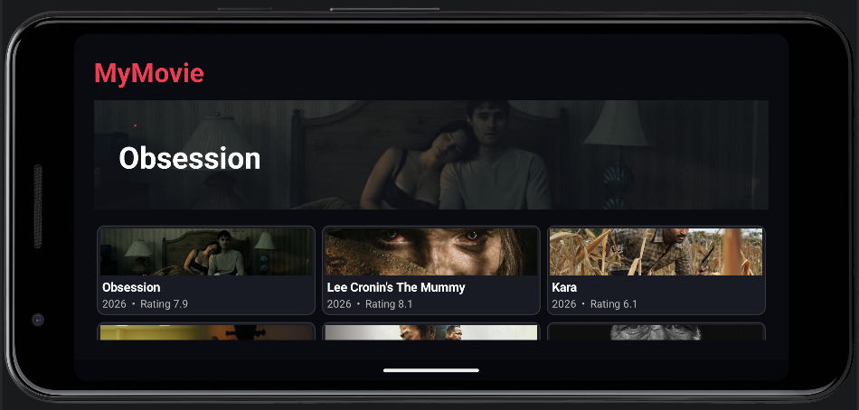
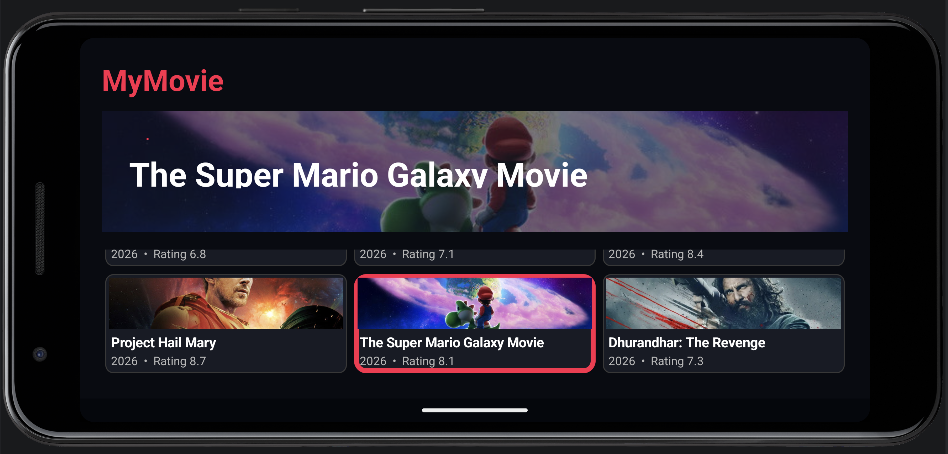
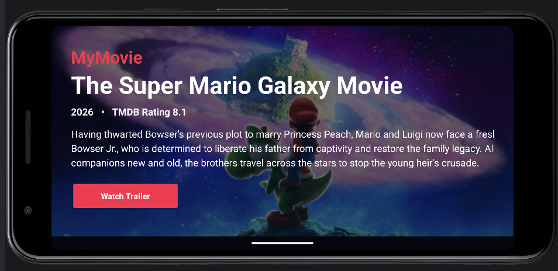
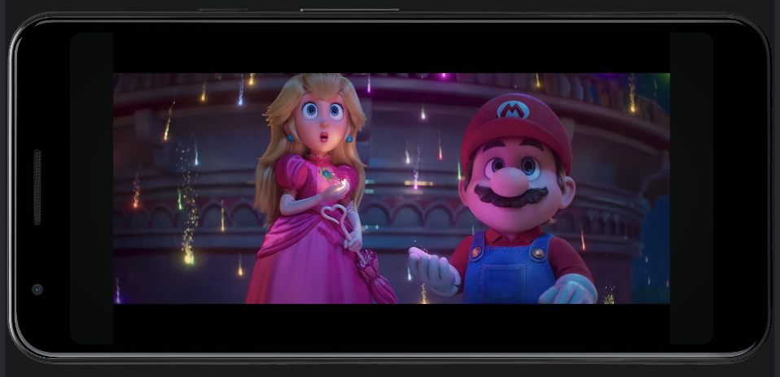

# MyMovie - TV Android Movie Application

## Student Information

* **Full name:** Nguyễn Lê Như Ngọc
* **Student ID:** 23521031
* **Course:** Mobile Development
* **Lab:** Lab 4
* **Project name:** MyMovie - TV Android Movie Application

## Project Overview

MyMovie is an Android movie application developed for **Lab 4** of the Mobile Development course. The app uses **The Movie Database (TMDB) API** to load real movie data, including movie titles, backdrop images, ratings, release years, and descriptions.

The application is designed with a TV-style movie browsing interface. Movies are displayed in a grid layout with three movies per row. Users can select a movie to view its information, open a separate movie detail screen, and watch the movie trailer through YouTube.

## Main Features

* Load real movie data from **TMDB API**.
* Display movie backdrop images in landscape scale.
* Show movie title, release year, TMDB rating, and overview.
* Display movies in a clean grid layout with **three movies per row**.
* Highlight the selected movie with a pink border.
* Update the hero section when a movie is selected.
* Open a separate movie detail screen.
* Watch movie trailers through YouTube.
* Landscape orientation by default for a movie-app experience.
* Android TV-style interface with focusable movie cards.

## Tech Stack

* **Programming language:** Kotlin
* **IDE:** Android Studio
* **Platform:** Android / Android TV style interface
* **API:** The Movie Database (TMDB) API
* **Networking:** HttpURLConnection
* **Data format:** JSON
* **UI:** XML Layout and Kotlin dynamic views
* **Build tool:** Gradle
* **Image loading:** BitmapFactory from TMDB image URLs

## Demo Video

The demo video showing how to use the MyMovie app is available here:

[MyMovie Demo Video](https://drive.google.com/drive/folders/1m7HB9Lh0vafy4VNSl-uy7XyKYO8SFUu_)

## App Screenshots

Place app screenshots in the `screenshots/` folder.

<table>
  <tr>
    <td align="center"><b>Home Screen</b></td>
    <td align="center"><b>Selected Movie</b></td>
  </tr>
  <tr>
    <td></td>
    <td></td>
  </tr>
  <tr>
    <td align="center"><b>Movie Detail Screen</b></td>
    <td align="center"><b>Trailer Screen</b></td>
  </tr>
  <tr>
    <td></td>
    <td></td>
  </tr>
</table>

## How to Use the App

### 1. Open the App

When the app opens, the screen is displayed in landscape mode. The app title **MyMovie** appears at the top-left corner.

### 2. Browse Movies

The app loads popular movies from TMDB and displays them in a grid layout. Each row contains three movies. Every movie card includes:

* Movie backdrop image
* Movie title
* Release year
* TMDB rating

### 3. Select a Movie

Tap on any movie card to select it. When a movie is selected:

* The movie card is highlighted with a pink border.
* The hero section updates to show the selected movie.
* The hero section displays the movie title, rating, release year, and overview.

### 4. Open Movie Detail

Tap the same movie again to open a separate movie detail screen. This screen shows:

* Large backdrop image
* Movie title
* Release year
* TMDB rating
* Movie overview
* Watch Trailer button

### 5. Watch Trailer

On the movie detail screen, tap **Watch Trailer**. The app opens YouTube to search for or play the trailer of the selected movie.

Note: TMDB API provides movie data, images, and video/trailer information. It does not provide full movie streaming files, so the app opens trailers instead of playing full movies directly inside the app.

### 6. Go Back

Tap the **Back** button or use the Android back gesture/button to return to the movie browsing screen.

## How the App Works

1. The app reads the TMDB access token from `local.properties`.
2. `TmdbApiClient.kt` sends a request to the TMDB API.
3. TMDB returns movie data in JSON format.
4. The app parses the JSON response into `Movie` objects.
5. `MainActivity.kt` displays the movies in a grid layout.
6. When a movie is selected, the hero section updates.
7. When a movie is opened, `MovieDetailActivity.kt` displays detailed information.
8. The trailer button opens YouTube using an external intent.

## Project Structure

```text
app/src/main/java/com/callmeshinny/tvandroidapplication/
├── MainActivity.kt
├── Movie.kt
├── TmdbApiClient.kt
└── MovieDetailActivity.kt

app/src/main/res/
├── layout/
│   ├── activity_main.xml
│   └── activity_movie_detail.xml
├── drawable/
│   ├── movie_card_background.xml
│   ├── movie_card_focused_background.xml
│   ├── movie_card_selected_background.xml
│   └── poster_placeholder.xml
└── values/
    ├── colors.xml
    ├── strings.xml
    └── themes.xml
```

## TMDB API Setup

This project uses a TMDB Read Access Token. The token should be stored in `local.properties`:

```text
TMDB_ACCESS_TOKEN=your_tmdb_read_access_token_here
```

The `local.properties` file is ignored by Git, so the API token is not pushed to GitHub.

## How to Run

1. Clone this repository:

```bash
git clone https://github.com/callmeshinny/UIT_Mobile_Lab4_TVAndroidApplication_23521031.git
```

2. Open the project in Android Studio.

3. Add the TMDB token to `local.properties`.

4. Wait for Gradle Sync to finish.

5. Run the app on an Android emulator or Android TV emulator.

Build from terminal:

```bash
./gradlew clean assembleDebug
```

Install on emulator or device:

```bash
./gradlew installDebug
```

## Notes

* The app requires internet connection to load movie data from TMDB.
* The app uses TMDB data and images for educational purposes.
* Full movie streaming is not provided by TMDB API.
* The Watch Trailer feature opens YouTube to view trailers.

## Author

**Nguyễn Lê Như Ngọc**
**Student ID:** 23521031
